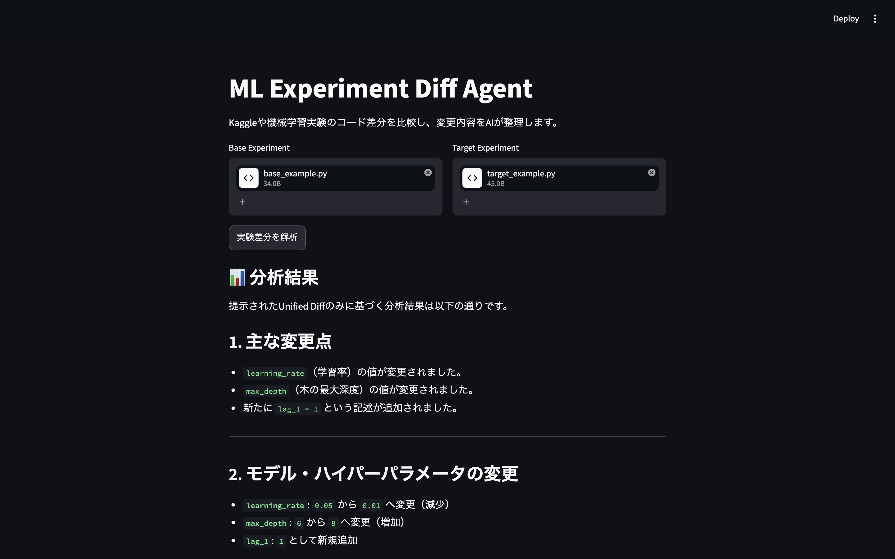
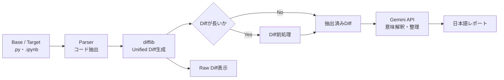

# ML Experiment Diff Agent

機械学習の実験コード（`.py` / `.ipynb`）を比較し、変更点を日本語で整理する Streamlit アプリです。

差分そのものを LLM に推測させるのではなく、Python 標準ライブラリで正確に抽出した差分だけを Gemini に渡します。これにより、決定論的な差分抽出と、LLM が得意とする意味の整理を分離しています。

## Demo



※ 画像は旧UIです。現在は差分を先に表示し、「AIで分析」を押したときだけ送信します。

> [!IMPORTANT]
> 本アプリはコードの変更内容と考えられる影響を整理するための支援ツールです。モデルのスコア改善や性能向上を自動判定するものではありません。実際の効果は、再学習と評価指標の確認によって検証してください。

## 主な機能

- 2つの Python ファイルまたは Jupyter Notebook をアップロード
- Notebook からコードセルのみを抽出
- Unified Diff 形式でコード差分を生成
- 大きな差分をキーワードベースで前処理
- Gemini による変更内容、ハイパーパラメータ、確認事項の日本語整理
- LLM に送信する前の Raw Diff を画面上で確認

## 設計上の工夫：Hybrid Architecture

本システムでは、機械学習実験コードの比較をすべて LLM に任せません。

1. `.py` / `.ipynb` を Python で解析
2. Python 標準の `difflib` で差分を決定論的に抽出
3. 必要に応じて Diff を前処理
4. 抽出済み Diff のみを LLM へ送信
5. LLM は変更内容の意味解釈・整理に限定して利用

つまり、**正確な差分抽出は通常のプログラム、意味解釈は LLM** が担当します。この責務分離により、LLM にコード全体の比較を委ねる構成よりも、分析対象を明確にしています。



## 技術スタック

- Python 3.13（開発・テスト環境）
- Streamlit
- Google Gen AI SDK (`google-genai`)
- Gemini API
- pytest

## ディレクトリ構成

```text
ml-diff-agent/
├── app.py                         # Streamlit UIと処理の呼び出し
├── prompts/
│   └── diff_analysis_prompt.txt   # Geminiへ渡す分析指示
├── sample/                        # 動作確認用の比較サンプル
├── src/
│   ├── parser.py                  # .py / .ipynbの解析
│   ├── diff_engine.py             # difflibによる差分生成
│   ├── diff_preprocessor.py       # 大きなDiffの前処理
│   └── llm_client.py              # Gemini APIとの通信
├── tests/                         # parser / diff / 前処理のテスト
└── requirements.txt
```

## セットアップ

### 1. リポジトリを取得

```bash
git clone https://github.com/ruy00803/ml-diff-agent.git
cd ml-diff-agent
```

フォルダ名は任意です。`diff_code`などの名前で保存している場合は、そのフォルダへ移動してください。

### 2. 仮想環境を作成して依存関係をインストール

```bash
python -m venv .venv
source .venv/bin/activate
python -m pip install --upgrade pip
pip install -r requirements.txt
```

Windows PowerShell では、仮想環境の有効化に次を使用します。

```powershell
.venv\Scripts\Activate.ps1
```

### 3. Gemini API キーを設定

[Google AI Studio](https://aistudio.google.com/app/apikey) で API キーを取得し、次のいずれかで `GEMINI_API_KEY` を設定します。

方法A：Streamlit Secrets（ローカル実行）

```bash
mkdir -p .streamlit
```

`.streamlit/secrets.toml` を作成します。

```toml
GEMINI_API_KEY = "your-api-key"
```

方法B：環境変数

```bash
export GEMINI_API_KEY="your-api-key"
```

Windows PowerShell：

```powershell
$env:GEMINI_API_KEY="your-api-key"
```

`.streamlit/secrets.toml` と `.env` は `.gitignore` に含まれています。API キーをソースコードやコミットへ含めないでください。

モデルは既定で`gemini-3.6-flash`を使用します。環境変数またはSecretsの`GEMINI_MODEL`で変更できます（環境変数を優先）。利用可能なモデルは[Google公式ドキュメント](https://ai.google.dev/gemini-api/docs/models/gemini-3.6-flash)を確認してください。

```toml
GEMINI_MODEL = "gemini-3.6-flash"
```

## 起動方法

プロジェクトのルートディレクトリで実行します。

```bash
python -m streamlit run app.py
```

ブラウザで表示された画面に Base と Target のファイルをアップロードします。Raw Diffと「Geminiへ送信する差分」を確認し、「AIで分析」を選択します。差分の表示だけではAPIを呼び出しません。API に送信されるのは、解析対象のファイル全体ではなく、抽出および必要に応じて前処理された Diff です。

動作確認には `sample/base_example.py` と `sample/target_example.py` を利用できます。

## サンプルの変更内容

付属サンプルでは`learning_rate`が`0.05 → 0.01`、`max_depth`が`6 → 8`に変わり、`lag_1 = 1`が追加されます。分析ではこれらの変更と検証事項を整理します。学習処理や評価結果がないため、精度が改善したとは判断できません。LLMの出力表現は実行ごとに変わります。

## テスト

```bash
python -m pytest -q
```

テストはファイル解析、Diff生成、前処理、APIエラー処理、Streamlitの差分プレビューと送信操作を対象としています。Gemini APIは模擬応答で検証し、実通信は自動テストの対象外です。GitHub ActionsでもPython 3.13で実行します。

## 現在の制約

- 対応形式は `.py` と `.ipynb` のみです。
- Notebook はコードセルだけを比較し、Markdown セルや出力結果は比較しません。
- 長い Diff はキーワードを含む行を優先して短縮するため、LLM のレポートにすべての変更が含まれない場合があります。Raw Diff では短縮前の差分を確認できます。
- LLM の回答は Diff に基づく解釈であり、実験結果やモデル性能を保証しません。
- Gemini API の利用には、提供元の料金、利用上限、データ取り扱い条件が適用されます。
